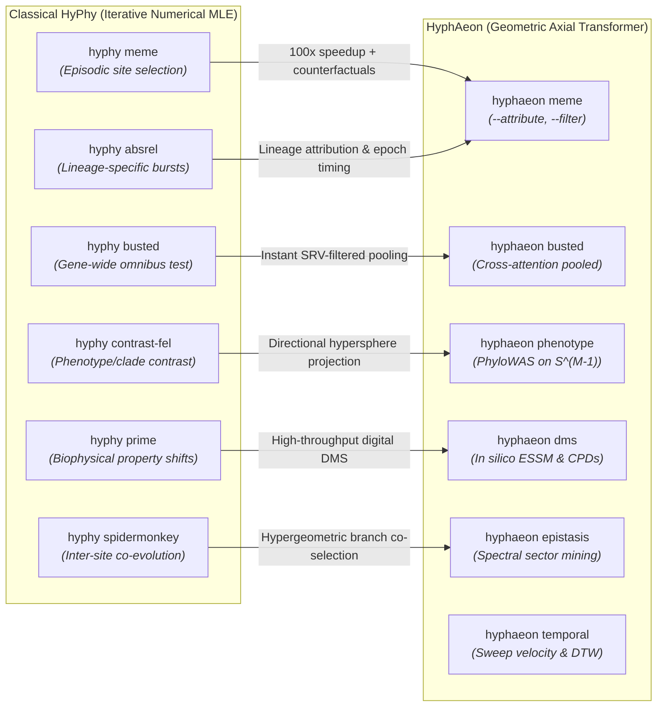
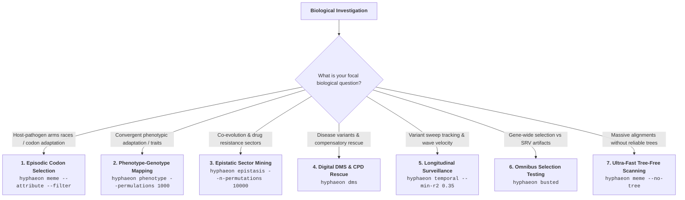

# From Maximum Likelihood to Geometric Deep Time: A HyPhy to HyphAeon Migration Guide

Estimation of $dN/dS$ has long been the computational workhorse of molecular adaptation. For over two decades, the **HyPhy** software package spearheaded this domain, providing an expressive, statistically rigorous framework for testing evolutionary hypotheses across continuous-time Markov substitution models. HyPhy established the seminal implementations of site-level episodic selection (MEME), pervasive site selection (FEL, FUBAR), gene-wide omnibus testing (BUSTED), branch-specific bursts (aBSREL), phenotypic selection contrasts (Contrast-FEL), and biophysical property constraints (PRIME).

Yet modern genomics has outgrown the computational substrate upon which classical maximum likelihood phylogenetics was built. When alignments routinely encompass tens of thousands of pathogen genomes or hundreds of vertebrate genomes spanning hundreds of millions of years of evolutionary divergence, standard Felsenstein tree-pruning algorithms and iterative numerical optimizers flounder on the shoals of computational intractability. Standard likelihood evaluations scale linearly with tree size but suffer steep quadratic and cubic penalties when estimating branch-site mixture models, calculating high-dimensional Fisher information matrices, or exploring combinatorial epistatic spaces.

**HyphAeon** resolves this impasse by replacing iterative numerical pruning over continuous-time Markov chains with a 2D axial foundation transformer trained over non-Euclidean tree manifolds. By embedding phylogenetic trees into four-dimensional geometric coordinates via classical multidimensional scaling (MDS) and encoding branch distances through continuous Tree-RoPE positional kernels, HyphAeon evaluates complex evolutionary, epistatic, and phenotypic hypotheses in milliseconds—delivering speedups exceeding two orders of magnitude while preserving strict statistical calibration.

This guide provides an authoritative roadmap for migrating from HyPhy to HyphAeon. The first section establishes a direct method-by-method translation ("If you do X in HyPhy, here is what you do in HyphAeon"). The second section deconstructs practical study design ("If you want to answer this biological question and have this type of data, then you can do this with HyphAeon").

---

## 1. The Rosetta Stone: If You Do X in HyPhy, What Do You Do in HyphAeon?

HyPhy decomposes molecular evolution into modular Batch Language scripts (`.bf`) executed through its command-line interface or web gateways like Datamonkey. HyphAeon unifies these workflows into an integrated CLI (`hyphaeon`) powered by hardware-accelerated PyTorch backends (CUDA, Apple Silicon MPS, or OpenMP multi-core CPU).



---

### 1.1 Episodic Diversifying Selection at Individual Sites

```bash
# Classical HyPhy: Mixed Effects Model of Evolution
hyphy meme --alignment data.fasta --tree data.nwk --output meme_results.json

# HyphAeon Equivalent: Neural Episodic Selection Scanning
hyphaeon meme -a data.fasta -t data.nwk -o hyphaeon_meme.json -c hyphaeon_meme.csv
```

HyPhy MEME models episodic diversifying selection by fitting a two-rate mixture model ($\beta_1 \le \alpha$ with probability $p$, and $\beta_2 > \alpha$ with probability $1-p$) independently at each codon, optimizing branch lengths and site rates via numerical maximum likelihood. While statistically robust, numerical optimization over $L$ codons on large trees requires substantial compute time and treats each site as an isolated column, entirely blind to flanking structural context or spatial linkage.

HyphAeon replaces site-by-site numerical optimization with 2D axial self-attention across species and sequence positions simultaneously. Tree-RoPE kernels inject continuous branch distances directly into the attention query-key inner products, computing likelihood-ratio test statistics (LRT), asymptotic $p$-values ($\frac{1}{2}\chi_0^2 + \frac{1}{2}\chi_1^2$), and Benjamini-Hochberg false discovery rate (FDR) $q$-values in seconds. Crucially, HyphAeon matches the standard HyPhy MEME JSON output schema, allowing direct downstream ingestion into existing visualization pipelines.

To identify exactly which species drive the selective signal and determine their evolutionary timing, append `--attribute`:

```bash
hyphaeon meme -a data.fasta -t data.nwk --attribute --attribution-min-lrt 3.84 -o attributed.json
```

This performs single-taxon counterfactual perturbations ($\Delta\text{LRT}$) in memory, ranking driving lineages by marginal signal explained and classifying adaptation into evolutionary epochs: recent terminal sweeps ($\ge 0.60$ root-to-tip depth), intermediate subclade bursts ($0.35\text{--}0.60$), or deep ancestral divergences ($< 0.35$).

---

### 1.2 Lineage-Specific Selection: Replacing aBSREL

```bash
# Classical HyPhy: Adaptive Branch-Site Random Effects Likelihood
hyphy absrel --alignment data.fasta --tree data.nwk --output absrel.json

# HyphAeon Equivalent: Single-Taxon Counterfactual Attribution
hyphaeon meme -a data.fasta -t data.nwk --attribute -o selection_with_lineages.json
```

HyPhy aBSREL infers episodic positive selection along specific branches of a phylogeny by testing whether a site-mixture model with $\omega > 1$ improves the likelihood over a neutral baseline on a branch-by-branch basis. Because aBSREL must independently test every branch across the tree, runtime scales aggressively with taxon sample size, and testing thousands of branches incurs severe multiple-testing penalties that erode statistical power.

HyphAeon achieves the same biological objective through mechanistic feature attribution without combinatorial branch testing. By evaluating the counterfactual drop in site selection drive ($\Delta\text{LRT}$) when non-consensus states are reverted to ancestral baselines, HyphAeon directly pinpoints the exact lineages responsible for episodic diversification. The output separates single-lineage terminal sweeps from recurrent multi-lineage adaptation across the entire topology in a single unified pass.

---

### 1.3 Alignment-Wide Omnibus Selection: Replacing BUSTED

```bash
# Classical HyPhy: Branch-Site Unrestricted Statistical Test for Episodic Diversification
hyphy busted --alignment data.fasta --tree data.nwk --srv Yes --output busted.json

# HyphAeon Equivalent: Cross-Attention Pooled Omnibus Testing
hyphaeon busted -a data.fasta -t data.nwk -o hyphaeon_busted.json
```

HyPhy BUSTED evaluates whether an entire gene has experienced episodic positive selection across any site and any branch, employing an unconstrained 3-rate distribution for $\omega$. Failing to account for synonymous rate variation (SRV) severely inflates BUSTED false positives; running with `--srv Yes` remedies this by incorporating a bivariate $(d_N, d_S)$ distribution, but at the cost of steep computational overhead from two-dimensional numerical quadrature.

HyphAeon deploys a dedicated cross-attention pooling head trained directly to integrate gene-wide selection dynamics while filtering synonymous rate variation artifacts. The model outputs the alignment-wide LRT, an omnibus $p$-value, and the predicted fraction of sites under selection ($\omega_3$ weight) instantaneously. Because the neural feature representations decouple synonymous conservation from non-synonymous acceleration, HyphAeon maintains strict false positive control under pervasive SRV without numerical quadrature.

---

### 1.4 Phenotype & Clade Association: Replacing Contrast-FEL

```bash
# Classical HyPhy: Contrast-FEL (Two-phenotype branch comparison)
hyphy contrast-fel --alignment data.fasta --tree data.nwk --branch-set Group1 --output contrast.json

# HyphAeon Equivalent: PhyloWAS (Directional Hypersphere Projection)
hyphaeon phenotype \
  -a data.fasta \
  -t data.nwk \
  -fg "SpeciesA,SpeciesB,SpeciesC" \
  --n-permutations 10000 \
  --permulations 1000 \
  -o pheno_results.json \
  -c pheno_sites.csv
```

Contrast-FEL tests whether selective pressures differ between two user-defined sets of branches (e.g., foreground versus background lineages) by comparing site-specific $\omega_{\text{foreground}}$ against $\omega_{\text{background}}$ via likelihood ratio tests. While effective for pairwise clade contrasts, Contrast-FEL is computationally limited when phenotypes are polyphyletic, continuous, or involve convergent multi-lineage transitions across hundreds of species.

HyphAeon generalizes clade comparisons to high-dimensional directional genotype-phenotype association mapping (PhyloWAS). Taxon phenotype vectors are centered, norm-standardized, and projected onto the unit hypersphere $\mathbb{S}^{M-1}$. The model computes site-level directional alignment ($\rho_s$), length-normalized spectral energies ($\bar{\Psi}$), Benjamini-Hochberg FDR $q$-values, and Phenotype-Associated Residue Signatures (PARS). Furthermore, HyphAeon couples site scoring with gene-level Brownian motion liability permulations (`--permulations 1000`), testing whether the observed association exceeds neutral phylogenetic drift along the tree.

---

### 1.5 Biophysical Property Constraints: Replacing PRIME

```bash
# Classical HyPhy: Property-Informed Model of Evolution
hyphy prime --alignment data.fasta --tree data.nwk --property Atchley_Factor --output prime.json

# HyphAeon Equivalent: Digital Deep Mutational Scanning (In Silico DMS)
hyphaeon dms -a data.fasta -t data.nwk -o dms_landscape.json -c dms_landscape.csv
```

HyPhy PRIME interrogates the biophysical drivers of selection by parameterizing amino acid exchangeabilities as functions of five biophysical property distances (polarity, charge, volume, secondary structure propensity, and hydropathy), estimating property-specific constraint multipliers ($\lambda$). However, PRIME must optimize non-linear property coefficients across high-dimensional matrices, which makes convergence fragile on short alignments and restricts inference to predefined univariate physicochemical scales.

HyphAeon formulates biophysical constraint discovery through comprehensive digital deep mutational scanning. The `dms` engine performs high-throughput in silico sweeps across all 19 alternative amino acids at every codon position, computing the complete $20 \times L$ fitness landscape and the Epistatic Selection Sensitivity Matrix (ESSM). This captures multidimensional non-linear epistatic constraints, calculates intrinsic site mutational plasticity ($\mathbf{E}_{i,i}$), and de novo predicts compensatory partner substitutions ($s_{\text{comp}}$) capable of rescuing deleterious mutations without requiring manual pre-specification of biophysical property vectors.

---

### 1.6 Inter-Site Co-Evolution: Replacing Bayesian Graphical Models / Spidermonkey

```bash
# Classical HyPhy: Spidermonkey / BGM
hyphy spidermonkey --alignment data.fasta --tree data.nwk --output bgm_edges.json

# HyphAeon Equivalent: Multi-Scale Epistatic Sector Mining
hyphaeon epistasis \
  -a data.fasta \
  -t data.nwk \
  --min-sim 0.30 \
  --n-permutations 10000 \
  --max-perm-p 0.05 \
  -o epistasis.json \
  -c edges.csv \
  --graphml network.graphml
```

Classical phylogenetic co-evolution methods like Spidermonkey or Bayesian Graphical Models (BGMs) reconstruct ancestral substitutions along trees and evaluate conditional independence graphs across pairs of sites. These approaches face severe combinatorial hurdles: testing all $\binom{L}{2}$ pairs on large proteins quickly becomes prohibitive, and ancestral state reconstruction errors accumulate along deep branches, creating spurious correlations.

HyphAeon tackles inter-site co-evolution through end-to-end phylogenetic branch attribution and exact tree hypergeometric tests. The `epistasis` engine calculates pairwise branch co-selection, suppresses structural redundancy via Jaccard overlap filtering, and accurately recovers 3D structural contacts ($C_\beta - C_\beta < 8\text{\AA}$). Candidate epistatic sectors are subjected to vectorized Monte Carlo permutation testing (`--n-permutations 10000`), evaluating spectral coherence against an empirical null distribution to verify that discovered sectors represent coordinated macromolecular complexes rather than stochastic collections of variable sites.

---

### 1.7 Tree-Free Estimation: Bypassing Phylogenetic Reconstruction Bottlenecks

```bash
# Classical HyPhy Workflow: Requires pre-computed tree
iqtree -s massive_aln.fasta -m GTR+G -T AUTO   # Hours or days
hyphy meme --alignment massive_aln.fasta --tree massive_aln.fasta.treefile

# HyphAeon Tree-Free Mode: Direct TN93 Geometric Embedding
hyphaeon meme -a massive_aln.fasta --no-tree -o results.json -c results.csv
```

In classical phylogenetics, selection analysis cannot begin until an explicit bifurcating phylogenetic tree is reconstructed. For massive viral alignments encompassing 10,000 to 100,000 sequences, maximum likelihood tree inference using IQ-TREE or RAxML represents an overwhelming computational bottleneck, consuming hundreds of CPU hours.

HyphAeon provides a native tree-free execution pathway (`--no-tree` or `--use-tn93`). Instead of demanding a resolved Newick topology, HyphAeon computes a pairwise Tamura-Nei 93 distance matrix directly from the alignment using an optimized C binary. The distance matrix is projected into four-dimensional geometric coordinates via classical multidimensional scaling (MDS), and sequences are embedded directly into the axial attention layers. This enables comprehensive selection scanning on massive datasets in minutes, bypassing the tree reconstruction bottleneck entirely.

---

### 1.8 Automated Alignment Artifact Filtering

```bash
# Classical Workflow: External heuristics or manual masking
# (e.g., ad-hoc Gblocks, trimAl, or custom Python scripts)

# HyphAeon Equivalent: Integrated Dual-Stage Alignment Error Screening
hyphaeon meme \
  -a raw_alignment.fasta \
  -t raw_tree.nwk \
  --filter \
  --filter-out-aln cleaned_alignment.fasta \
  -o cleaned_results.json
```

Sequencing errors, out-of-frame indels, and low-quality assembly segments frequently manufacture false positive selection signals. In traditional workflows, researchers rely on disconnected external filtering packages that aggressively strip columns or discard divergent taxa, frequently discarding authentic evolutionary innovations.

HyphAeon integrates automated dual-stage alignment error filtering directly into the selection inference loop (`--filter`). The algorithm identifies 1D selective clusters via exact upper-tail hypergeometric scans ($p_{\text{local}} \le 0.01$), then evaluates the Outlier Contamination Index ($\text{OCI} \ge 0.25$) to flag private frameshifts (three or more contiguous radical mutations isolated to a single leaf against deeply conserved relatives). Crucially, HyphAeon performs surgical in-place masking, replacing only the anomalous segment of the guilty taxon with `NNN` and re-evaluating the alignment in milliseconds—eliminating spurious artifacts while preserving legitimate multi-lineage selection.

---

## 2. Biological Problem-Solving Engine: If You Want to Answer This Question, What Do You Do?

Selecting an evolutionary analysis strategy depends on the specific biological question under investigation and the architectural characteristics of the empirical dataset. Below are concrete, production-ready recipes for the most common evolutionary genomics workflows.



---

### 2.1 Question 1: Pinpointing Episodic Host-Pathogen Arms Races and Adaptive Codon Substitutions

* **Biological Objective**: You want to identify which specific amino acid positions in a viral envelope, receptor, or host restriction factor are undergoing recurrent diversifying selection, determine which specific host lineages drove the adaptation, and confirm that the signals are not artifacts of sequencing errors or local misalignments.
* **Input Data**: A codon-aligned multi-species FASTA file (`gene.fasta`) and an associated phylogenetic tree (`gene.nwk`) spanning 10 to 500 species (e.g., primate OAS1, mammalian tetherin, or retroviral pol).

```bash
hyphaeon meme \
  -a examples/Smc6.fasta \
  -t examples/Smc6.nwk \
  --attribute \
  --attribution-min-lrt 3.84 \
  --filter \
  --filter-out-aln examples/Smc6_cleaned.fasta \
  -o examples/Smc6_selection.json \
  -c examples/Smc6_selection.csv
```

* **What HyphAeon Delivers**:
  1. Per-codon LRT statistics, asymptotic $p$-values ($\frac{1}{2}\chi_0^2 + \frac{1}{2}\chi_1^2$), and Benjamini-Hochberg FDR $q$-values in `Smc6_selection.csv`.
  2. Single-taxon counterfactual attribution ($\Delta\text{LRT}$) ranking the exact lineages driving positive selection at each significant codon.
  3. Evolutionary epoch decomposition classifying adaptation into recent terminal sweeps ($\ge 0.60$), intermediate subclade bursts ($0.35\text{--}0.60$), or deep ancestral divergences ($< 0.35$).
  4. Surgical filtering of isolated sequencing errors and frameshifts, writing the artifact-scrubbed alignment to `Smc6_cleaned.fasta`.

---

### 2.2 Question 2: Mapping Convergent Molecular Evolution Driving Phenotypic Novelty (PhyloWAS)

* **Biological Objective**: Multiple independent lineages have converged on a physiological, morphological, or ecological innovation (e.g., echolocation in bats and cetaceans, deep-sea diving adaptations in marine mammals, venom evolution in reptiles, or high-altitude hypoxia tolerance in birds). You need to identify the exact amino acid substitutions that correlate with the convergent trait while rigorously controlling for shared phylogenetic ancestry.
* **Input Data**: A multi-species codon alignment (`RHO.fasta`) and either a comma-separated list of foreground taxa (`-fg`) or a metadata CSV file containing categorical or continuous trait annotations.

```bash
hyphaeon phenotype \
  -a examples/RHO.fasta \
  -fg "turTru,balMus,balPhys,orcOrc,delDelp,phyCat,phoVit,halGryp,mirLeo,zalCali,odoRos" \
  --n-permutations 10000 \
  --max-perm-p 0.05 \
  --permulations 1000 \
  -o examples/RHO_marine.json \
  -c examples/RHO_marine_sites.csv
```

* **What HyphAeon Delivers**:
  1. Hyperspherical directional correlation ($\rho_s$) and length-normalized spectral energy ($\bar{\Psi}$) for every codon position.
  2. Benjamini-Hochberg FDR $q$-values controlling genome-wide false discovery across sites.
  3. Phenotype-Associated Residue Signatures (PARS) defining the specific amino acid motifs that characterize foreground species versus background relatives.
  4. Vectorized macromolecular trait sector permutation testing (`--n-permutations 10000`), demonstrating whether trait-associated residues form structurally coherent complexes.
  5. Gene-level Brownian motion liability permulations (`--permulations 1000`), proving whether overall gene-phenotype association exceeds neutral phylogenetic drift.

---

### 2.3 Question 3: Resolving 3D Epistatic Networks, Drug Resistance Complexes, and Structural Sectors

* **Biological Objective**: In an evolving pathogen or somatic tumor gene, mutations rarely act in isolation. You need to discover all pairwise epistatic interactions, reconstruct structural sectors, and uncover mutually antagonistic evolutionary pathways (e.g., separating primary catalytic resistance mutations from secondary compensatory mutations, or distinguishing TAM-1 from TAM-2 resistance complexes in HIV-1 reverse transcriptase).
* **Input Data**: A dense alignment of pathogen or tumor sequences (`HIV1_RT.fasta`) and a phylogenetic tree (`HIV1_RT.nwk`).

```bash
hyphaeon epistasis \
  -a examples/HIV1_RT.fasta \
  -t examples/HIV1_RT.nwk \
  --min-sim 0.30 \
  --min-lrt 1.0 \
  --max-fdr 0.05 \
  --n-permutations 10000 \
  --max-perm-p 0.05 \
  -o examples/HIV1_RT_epistasis.json \
  -c examples/HIV1_RT_edges.csv \
  --graphml examples/HIV1_RT_network.graphml
```

* **What HyphAeon Delivers**:
  1. A complete ranked edge list of co-evolving codon pairs with exact phylogenetic branch co-selection scores and branch-sharing hypergeometric $p$-values.
  2. Recovery of 3D physical contacts ($C_\beta - C_\beta < 8\text{\AA}$), allowing de novo structural constraint mapping from sequence alignments alone.
  3. Spectral decomposition of epistatic sectors with Monte Carlo permutation significance testing ($p_{\text{perm}} \le 0.05$).
  4. Network topologies exported in GraphML format (`HIV1_RT_network.graphml`) ready for immediate visualization in Cytoscape or Gephi.

---

### 2.4 Question 4: Predicting Disease Mutation Tolerability and Epistatic Compensatory Rescuers

* **Biological Objective**: A clinical sequencing screen identifies a missense variant of uncertain significance (VUS) in a human patient. You want to assess its evolutionary impact, determine whether the mutation is tolerated in orthologous proteins from other species (Compensated Pathogenic Deviations, or CPDs), and computationally identify secondary compensatory mutations that rescue functional stability.
* **Input Data**: A vertebrate-wide ortholog alignment of the human disease gene (`disease_gene.fasta`) and the canonical species tree (`species_tree.nwk`).

```bash
hyphaeon dms \
  -a examples/HIV1_RT.fasta \
  -t examples/HIV1_RT.nwk \
  -o examples/RT_dms.json \
  -c examples/RT_dms.csv
```

* **What HyphAeon Delivers**:
  1. A complete $20 \times L$ digital deep mutational scanning fitness matrix, estimating the evolutionary selection cost of every possible amino acid substitution across the protein.
  2. Intrinsic mutational plasticity ($\mathbf{E}_{i,i}$), highlighting rigid catalytic cores versus flexible, permissive surface loops.
  3. Full Epistatic Selection Sensitivity Matrix (ESSM) modeling pairwise mutational couplings.
  4. Ranked compensatory rescuer predictions ($s_{\text{comp}}$) that identify which secondary mutations restore fitness to human disease alleles.

---

### 2.5 Question 5: Tracking Selective Sweeps and Sweep Velocity in Longitudinal Surveillance

* **Biological Objective**: You have time-stamped viral genomic sequences collected during an ongoing epidemic (e.g., SARS-CoV-2, influenza H3N2, RSV, or mpox). You need to track when positive selection intensified along the timeline, measure the sweep velocity of emerging variants, align mutation dynamics to epidemiological infection waves, and separate true causal antigenic drivers from passenger mutations.
* **Input Data**: A longitudinal FASTA alignment where sequence headers contain ISO timestamps (`>seq_name|2023-08-15` or `>seq_name_2023.62`) and an optional surveillance tree.

```bash
hyphaeon temporal \
  -a surveillance_spike.fasta \
  -t surveillance_spike.nwk \
  --min-r2 0.35 \
  --time-bins 40 \
  --out-dir temporal_surveillance/
```

* **What HyphAeon Delivers**:
  1. Time-resolved selection histories $\hat{a}_s(t)$ fitted via bounded logistic trajectory regression across epidemiological time.
  2. Positive sweep velocities $v_s(t) = \max(0, \frac{d}{dt}\hat{a}_s(t))$, capturing the instantaneous rate of selective sweep expansion and flagging peak adaptation epochs.
  3. Dynamic Time Warping (DTW) distance clustering that groups mutations into coordinated selective waves.
  4. Temporal SVD factor loading trajectories ($L_{s, k}$) that distinguish in-phase primary adaptive drivers from delayed hitchhiking variants.

---

### 2.6 Question 6: Testing Gene-Wide Selection Without Synonymous Rate Variation False Positives

* **Biological Objective**: You want to test whether an entire gene family or viral open reading frame exhibits evidence of positive selection across its evolutionary history, but the gene is subject to strong RNA secondary structure constraints or GC-content gradients that cause synonymous substitution rates to vary drastically across sites.
* **Input Data**: A multi-species codon alignment (`family.fasta`) and tree (`family.nwk`).

```bash
hyphaeon busted \
  -a examples/bat_oas1.fasta \
  -t examples/bat_oas1.nwk \
  -o bat_oas1_busted.json
```

* **What HyphAeon Delivers**:
  1. A gene-wide likelihood ratio test statistic and omnibus asymptotic $p$-value evaluated via multi-query cross-attention pooling.
  2. Estimated fraction of sites in the third selection class ($\omega_3$ component weight).
  3. Complete protection against synonymous rate variation (SRV) false positives, delivering in milliseconds what requires hours of numerical quadrature under classical models.

---

### 2.7 Question 7: Selection Analysis on 50,000+ Sequences Without Tree Reconstruction

* **Biological Objective**: You have an alignment of 25,000 to 100,000 viral or bacterial sequences collected during an outbreak. Inferring a reliable maximum-likelihood tree with IQ-TREE or RAxML would take days or weeks of compute time, and the resulting bifurcating tree would contain thousands of zero-length branches and unresolved polytomies. You need immediate, tree-free episodic selection inference.
* **Input Data**: A large FASTA alignment (`outbreak_100k.fasta`) without a phylogenetic tree.

```bash
hyphaeon meme \
  -a outbreak_100k.fasta \
  --no-tree \
  -o outbreak_selection.json \
  -c outbreak_selection.csv
```

* **What HyphAeon Delivers**:
  1. Direct pairwise Tamura-Nei 93 distance matrix computation via optimized C binary, bypassing tree reconstruction entirely.
  2. Classical multidimensional scaling (MDS) projection into 4D geometric branch coordinates.
  3. Full codon-level episodic selection scanning with Benjamini-Hochberg FDR control completed in minutes on standard workstation hardware.

---

## 3. Command-Line Quick Reference: HyPhy vs. HyphAeon

| Biological Objective | Classical HyPhy CLI | HyphAeon CLI Equivalent | Computational Complexity | Primary Output Artifact |
| :--- | :--- | :--- | :--- | :--- |
| **Episodic Site Selection** | `hyphy meme -a A.fa -t T.nwk` | `hyphaeon meme -a A.fa -t T.nwk` | $O(L \cdot N) \rightarrow O(L + N)$ | `results.json`, `results.csv` |
| **Lineage Attribution** | `hyphy absrel -a A.fa -t T.nwk` | `hyphaeon meme --attribute` | $O(B \cdot L \cdot N) \rightarrow O(L \cdot K)$ | JSON `attribution` dict |
| **Alignment Artifact Scrubbing** | External scripts / manual | `hyphaeon meme --filter` | Ad-hoc $\rightarrow$ $O(L)$ exact | `cleaned.fasta`, JSON |
| **Gene Omnibus Test** | `hyphy busted --srv Yes` | `hyphaeon busted -a A.fa -t T.nwk` | $O(Q \cdot N) \rightarrow O(1)$ pool | `busted.json` |
| **Trait Association (PhyloWAS)** | `hyphy contrast-fel` | `hyphaeon phenotype -fg "sp1,sp2"` | $O(C \cdot L \cdot N) \rightarrow O(L \cdot M)$ | `pheno_sites.csv`, PARS |
| **Trait Permulations** | External R scripts | `hyphaeon phenotype --permulations B` | Slow $\rightarrow$ Vectorized tensor | Empirical $p_{\text{gene}}$ |
| **3D Epistasis & Sectors** | `hyphy spidermonkey` | `hyphaeon epistasis --n-permutations B` | Combinatorial $\rightarrow$ Spectral | `edges.csv`, `network.graphml` |
| **Digital DMS & CPDs** | `hyphy prime` | `hyphaeon dms -a A.fa -t T.nwk` | Slow $\rightarrow$ High-throughput | Full $20 \times L$ ESSM matrix |
| **Longitudinal Sweep Velocity** | Ad-hoc time bins | `hyphaeon temporal --min-r2 0.35` | Custom $\rightarrow$ Vectorized DTW | $v_s(t)$ trajectories, waves |
| **Tree-Free Massive Scale** | Unsupported | `hyphaeon meme --no-tree` | Blocked $\rightarrow$ $O(N^2)$ TN93 | Full selection scan |

---

## 4. Computational Execution & Hardware Optimization

HyphAeon automatically detects and utilizes the highest-performance acceleration hardware available on your system.

### Hardware Acceleration Flags

* **Apple Silicon GPUs (M1/M2/M3/M4)**: Acceleration via Apple Metal Performance Shaders (MPS) is enabled by default. To force CPU execution, supply `--cpu`:
  ```bash
  hyphaeon meme -a data.fasta -t data.nwk --cpu
  ```
* **NVIDIA GPUs (CUDA)**: HyphAeon automatically allocates tensors to the primary CUDA device (`cuda:0`). To process very large alignments on GPUs with constrained VRAM, specify batch sizing:
  ```bash
  hyphaeon meme -a data.fasta -t data.nwk --batch-size 128
  ```
* **Multi-Core Workstations**: OpenMP multi-threading is automatically scaled to available physical cores. Set the standard `OMP_NUM_THREADS` environment variable to restrict CPU resource allocation:
  ```bash
  export OMP_NUM_THREADS=16
  hyphaeon meme -a data.fasta -t data.nwk
  ```

---

## 5. Output Schemas & Downstream Integration

HyphAeon prioritizes backwards compatibility with existing bioinformatics pipelines. Output JSON files preserve standard HyPhy conventions, allowing downstream visualization tools developed for HyPhy (such as Datamonkey web visualizers or HyPhy Vision) to ingest HyphAeon results without format translation.

### JSON Schema Alignment

Every `hyphaeon meme` JSON file contains:
* `input`: Alignment metadata, sequence counts ($N$), codon length ($L$), and tree topology.
* `fits`: Baseline nucleotide GTR and tree length parameters.
* `MLE`: Maximum likelihood estimates structured as `content.by-site`, containing:
  * `LRT`: Likelihood ratio test statistic measuring deviation from neutral evolution.
  * `p-value`: Asymptotic $p$-value from mixture distribution $\frac{1}{2}\chi_0^2 + \frac{1}{2}\chi_1^2$.
  * `q-value`: Benjamini-Hochberg false discovery rate across all codons.
  * `alpha`: Inferred neutral synonymous baseline substitution rate.
  * `beta`: Inferred non-synonymous substitution rate under selection.
  * `attribution`: *(When run with `--attribute`)* Lineage-specific rankings, percent signal explained, and evolutionary epoch classifications.

Tabular outputs (`.csv`) provide human-readable summaries designed for direct manipulation in R (`tidyverse`), Python (`pandas`), or downstream manuscript figure generation.
