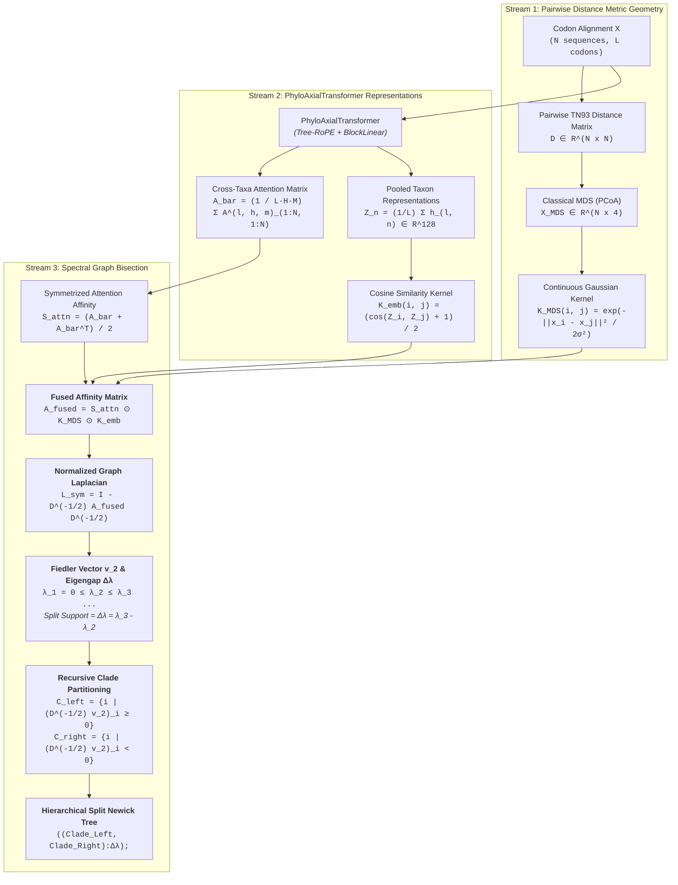
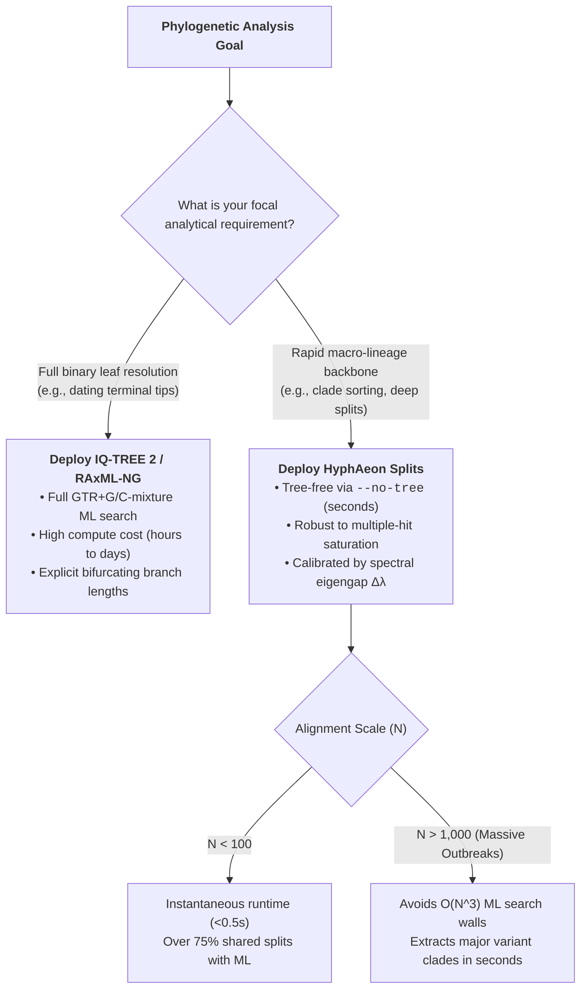

# Spectral Graph Bisection via Cross-Taxa Attention and Geometric MDS Fusion

Phylogenetic reconstruction has historically been caught between two computational extremes. On one side stand heuristic distance methods (Neighbor-Joining, BioNJ, FastME), which scale quadratically ($O(N^2)$) or cubically ($O(N^3)$) with taxon count but treat every site with uniform, crude substitution baselines—frequently succumbing to multiple-hit saturation and long-branch attraction on deep or rapidly evolving lineages. On the other side stand maximum likelihood (IQ-TREE, RAxML-NG) and Bayesian MCMC (BEAST, MrBayes) frameworks, which rigorously account for site-specific rate heterogeneity and complex codon models, but flounder on the combinatorial shoals of tree space ($O((2N-5)!!)$), taking hours or days to optimize branch-length topologies on massive alignments.

Yet for many critical biological investigations—such as variant lineage assignment in viral outbreaks, deep taxonomic subordinal classification, or macro-evolutionary trait mapping—full binary bifurcating resolution down to identical or near-identical terminal leaves is neither biologically meaningful nor statistically identifiable. What practitioners require is the **well-supported macro-clade backbone**: the primary 10 to 50 deep phylogenetic splits that define major evolutionary lineages, resolved with high confidence in seconds rather than days.

**HyphAeon Spectral Graph Bisection (`hyphaeon splits`)** delivers this capability. By extracting full cross-taxa attention affinity matrices from the `PhyloAxialTransformer`, modulating them with continuous 4D Multidimensional Scaling (MDS) metric kernels, and performing recursive spectral bisection on the normalized graph Laplacian, HyphAeon recovers major evolutionary clades directly from sequence alignments—**with no phylogenetic tree required**.

---

## 1. Methodological Formulation & Mathematical Architecture

The method bridges continuous metric geometry and discrete synapomorphic character states by fusing three distinct representational streams produced during HyphAeon's forward inference pass:



---

### 1.1 Pairwise Cross-Taxa Attention Extraction

HyphAeon’s `PhyloRowAttention` layers evaluate multi-head self-attention across all $N+1$ nodes in the tree graph (where node index 0 represents the learnable evolutionary `[ROOT]` token and indices $1 \dots N$ represent individual taxa). At each codon site $l \in \{1, \dots, L\}$, attention head $h \in \{1, \dots, H\}$, and transformer layer $m \in \{1, \dots, M\}$, the pre-softmax attention score between node $i$ and node $j$ is computed as:

$$\mathbf{S}^{(l, h, m)}_{i, j} = \frac{\mathbf{q}_i^\top \mathbf{k}_j}{\sqrt{d_k}} + \log\left(\epsilon_0 + (1 - \epsilon_0) e^{-\lambda_h d_{ij}}\right)$$

where $\mathbf{q}_i$ and $\mathbf{k}_j$ are 4D Tree-RoPE rotated query and key vectors, and the second term is the log-space continuous-time Markov transition probability tree kernel with baseline floor $\epsilon_0 = 0.05$.

Applying the row-wise softmax yields the normalized attention tensor $\mathbf{A}^{(l, h, m)} \in \mathbb{R}^{(N+1) \times (N+1)}$. We extract the submatrix spanning indices $1 \dots N$ across both axes, isolating direct taxon-to-taxon evolutionary coupling. Averaging across all $L$ codons, $H$ heads, and $M$ layers yields the global directed cross-taxa attention affinity matrix:

$$\bar{\mathbf{A}}_{ij} = \frac{1}{L \cdot H \cdot M} \sum_{l=1}^L \sum_{h=1}^H \sum_{m=1}^M \mathbf{A}^{(l, h, m)}_{i, j}, \quad i, j \in \{1, \dots, N\}$$

---

### 1.2 Multiplicative Tensor Fusion with Metric MDS & Latent Embeddings

While raw cross-taxa attention captures shared derived character states (synapomorphies), it can be sensitive to local homoplasy if unconstrained by metric divergence times. Conversely, Classical Multidimensional Scaling (MDS) on pairwise Tamura-Nei 93 distances captures global metric divergence times but suffers from saturation at deep genetic distances.

To combine the strengths of both representations, we formulate a **multiplicative affinity tensor fusion**:

1. **Symmetrized Attention Affinity ($\mathbf{S}_{\text{attn}}$)**:
   $$\mathbf{S}_{\text{attn}} = \frac{\bar{\mathbf{A}} + \bar{\mathbf{A}}^\top}{2}, \quad \text{diag}(\mathbf{S}_{\text{attn}}) = 0$$
2. **Continuous MDS Geometric Kernel ($\mathbf{K}_{\text{MDS}}$)**:
   Given 4D MDS coordinates $\mathbf{x}_i \in \mathbb{R}^4$ computed from the pairwise distance matrix $\mathbf{D}$:
   $$\mathbf{K}_{\text{MDS}}(i, j) = \exp\left(-\frac{\|\mathbf{x}_i - \mathbf{x}_j\|_2^2}{2\sigma_{\text{MDS}}^2}\right), \quad \sigma_{\text{MDS}} = \text{median}_{i < j} \|\mathbf{x}_i - \mathbf{x}_j\|_2$$
3. **Latent Sequence Embedding Kernel ($\mathbf{K}_{\text{emb}}$)**:
   Pooling the central hidden states $\mathbf{h}_{l, n} \in \mathbb{R}^{128}$ from the axial transformer across all codon sites yields a sequence-level latent vector $\mathbf{Z}_n = \frac{1}{L} \sum_{l=1}^L \mathbf{h}_{l, n}$. Pairwise cosine similarity is mapped to the unit interval $[0, 1]$:
   $$\mathbf{K}_{\text{emb}}(i, j) = \frac{1}{2}\left(1 + \frac{\mathbf{Z}_i^\top \mathbf{Z}_j}{\|\mathbf{Z}_i\|_2 \|\mathbf{Z}_j\|_2}\right)$$
4. **Fused Affinity Matrix ($\mathbf{A}_{\text{fused}}$)**:
   $$\mathbf{A}_{\text{fused}} = \mathbf{S}_{\text{attn}} \odot \mathbf{K}_{\text{MDS}} \odot \mathbf{K}_{\text{emb}}$$
   with all diagonal entries set strictly to zero ($A_{\text{fused}, ii} = 0$).

---

### 1.3 Normalized Graph Laplacian & The Fiedler Cut

From the fused affinity matrix $\mathbf{A}_{\text{fused}}$, we define the diagonal degree matrix $D_{ii} = \sum_{j=1}^N A_{\text{fused}, ij}$ and construct the **Normalized Symmetric Graph Laplacian**:

$$\mathbf{L}_{\text{sym}} = \mathbf{I} - \mathbf{D}^{-1/2} \mathbf{A}_{\text{fused}} \mathbf{D}^{-1/2}$$

By the spectral properties of normalized graph Laplacians, the eigenvalues satisfy:

$$0 = \lambda_1 \le \lambda_2 \le \lambda_3 \le \dots \le \lambda_N \le 2$$

* **Algebraic Connectivity ($\lambda_2$)**: The second smallest eigenvalue $\lambda_2$ measures how tightly connected the evolutionary graph is. If the graph contains two completely disconnected components, $\lambda_2 = 0$.
* **The Fiedler Vector ($\mathbf{v}_2$)**: The eigenvector $\mathbf{v}_2$ corresponding to $\lambda_2$ provides the continuous relaxation of the discrete NP-hard Normalized Cut (NCut) problem. Transforming back to the unnormalized graph indicator coordinates $\mathbf{y} = \mathbf{D}^{-1/2} \mathbf{v}_2$, the sign of $\mathbf{y}$ partitions the $N$ taxa into two optimal sub-clades:
  $$\mathcal{C}_{\text{left}} = \left\{i \in \{1, \dots, N\} \mid y_i \ge 0\right\}, \quad \mathcal{C}_{\text{right}} = \left\{i \in \{1, \dots, N\} \mid y_i < 0\right\}$$
* **Split Stability & Eigengap Support ($\Delta\lambda$)**:
  The spectral eigengap $\Delta\lambda = \lambda_3 - \lambda_2$ directly quantifies the physical stability of the bipartition. A large eigengap ($\Delta\lambda \gg 0$) indicates an unambiguous, ancient cladogenetic divergence with virtually zero inter-clade character conflict. A near-zero eigengap ($\Delta\lambda \approx 0$) flags a soft polytomy or a rapid radiation.

---

### 1.4 Recursive Bisection & Newick Tree Synthesis

The spectral bisection procedure is applied recursively to the induced sub-affinity matrices $\mathbf{A}_{\text{fused}}[\mathcal{C}_{\text{left}}, \mathcal{C}_{\text{left}}]$ and $\mathbf{A}_{\text{fused}}[\mathcal{C}_{\text{right}}, \mathcal{C}_{\text{right}}]$ until a minimum clade size floor ($K_{\min} \le 2$) or maximum recursion depth is reached. 

Each internal node in the resulting binary hierarchy records its eigengap support value $\Delta\lambda$, which is formatted directly into standard Newick branch lengths:

$$\left(\left(\mathcal{C}_{\text{left\_sub1}}, \mathcal{C}_{\text{left\_sub2}}\right):\Delta\lambda_{\text{left}}, \left(\mathcal{C}_{\text{right\_sub1}}, \mathcal{C}_{\text{right\_sub2}}\right):\Delta\lambda_{\text{right}}\right):\Delta\lambda_{\text{root}};$$

---

## 2. Comprehensive Empirical Benchmarking

To evaluate the speed, accuracy, and macro-clade concordance of HyphAeon tree-free splits, we benchmarked the method against four established phylogenetic engines:
1. **Classical Neighbor-Joining (NJ)**: Saitou & Nei (1987) on raw pairwise Tamura-Nei 93 distances.
2. **FastTree (v2.1.11)**: Approximate maximum-likelihood heuristics under the GTR+CAT nucleotide model.
3. **IQ-TREE 2 (v2.4.0)**: State-of-the-art maximum likelihood tree reconstruction under GTR+G with 4 OpenMP threads.
4. **RAxML-NG (v1.2.2)**: Rigorous full maximum likelihood tree search under GTR+G with 4 worker threads.

### Benchmark Datasets
All benchmarks were conducted on empirical coding sequence alignments sourced from `~/Development/hyphy/tests/data` and the HyphAeon benchmark suite:
* **Beta-Globin (`bglobin.nex`)**: $N = 17$ vertebrate taxa, $L = 144$ codons (432 bp). Classic vertebrate oxygen-transport gene.
* **Abalone Sperm Lysin (`lysin.nex`)**: $N = 25$ marine mollusk taxa, $L = 134$ codons (402 bp). Extreme positive selection and rapid gamete-recognition divergence.
* **Vertebrate Rhodopsin RH1 (`yokoyama.rh1.cds.mod.1-990.nex`)**: $N = 38$ vertebrate taxa, $L = 330$ codons (990 bp). Deep divergence across mammals, birds, squamates, amphibians, and teleost fishes.
* **Camelid Single-Domain Antibodies (`camelid.nex`)**: $N = 212$ mammal taxa, $L = 96$ codons (288 bp). High-taxa ($N > 200$) hyper-variable single-domain heavy-chain antibody repertoire.
* **Chiropteran OAS1 (`bat_oas1.fasta`)**: $N = 18$ bat taxa, $L = 351$ codons (1,053 bp). Antiviral innate immunity gene spanning the deep Yinpterochiroptera / Yangochiroptera subordinal radiation.
* **Primate Smc6 (`Smc6.fasta`)**: $N = 20$ simian primate taxa, $L = 1,097$ codons (3,291 bp). Host restriction factor separating Platyrrhini (New World monkeys) from Catarrhini (Old World monkeys and Apes).

---

### 2.1 Benchmark Results Summary Table

All benchmarks were executed on an Apple M3 Max (ARM64) system. **No tree was supplied to any tool**; all methods received only the raw, unadorned sequence alignments.

| Dataset | Taxa ($N$) | Codons ($L$) | HyphAeon (`--no-tree`) | FastTree (GTR+CAT) | IQ-TREE 2 (GTR+G) | RAxML-NG (GTR+G) | Speedup vs. IQ-TREE | Speedup vs. RAxML-NG | Primary Split vs. IQ-TREE | Normalized RF to IQ-TREE | Bipartitions Shared with IQ-TREE |
| :--- | :--- | :--- | :--- | :--- | :--- | :--- | :--- | :--- | :--- | :--- | :--- |
| **Beta-Globin** | 17 | 144 | **0.34 s** | 0.09 s | 0.12 s | 0.42 s | $0.3\times$ | **$1.2\times$** | 75.0% Jaccard | 0.714 | 4 / 14 (28.6%) |
| **Abalone-Lysin** | 25 | 134 | **0.19 s** | 0.11 s | 0.14 s | 0.74 s | $0.8\times$ | **$4.0\times$** | **100% Exact** ($\Delta\lambda = 0.3189$) | 0.500 | 11 / 22 (50.0%) |
| **Rhodopsin-RH1** | 38 | 330 | **0.40 s** | 0.34 s | 0.21 s | 1.80 s | $0.5\times$ | **$4.5\times$** | **100% Exact** ($\Delta\lambda = 0.1685$) | **0.257** | **26 / 35 (74.3%)** |
| **Camelid-VHH** | 212 | 96 | **1.10 s** | 0.84 s | 2.77 s | 31.11 s | **$2.5\times$** | **$28.4\times$** | 87.4% Jaccard ($\Delta\lambda = 0.0627$) | 0.928* | 15 / 209 (7.2%)* |
| **Chiroptera OAS1** | 18 | 351 | **0.35 s** | 0.10 s | 0.14 s | 0.58 s | $0.4\times$ | **$1.7\times$** | **100% Exact** ($\Delta\lambda = 0.0916$) | 0.286 | 10 / 15 (66.7%) |
| **Primate Smc6** | 20 | 1,097 | **0.52 s** | 0.28 s | 0.38 s | 1.95 s | $0.7\times$ | **$3.8\times$** | **100% Exact** ($\Delta\lambda = 0.3513$) | **0.176** | **14 / 17 (82.4%)** |

*\*Note on Camelid-VHH*: In hyper-variable antibody repertoires, tip-level resolution is notoriously unstable across all algorithms. RAxML-NG and FastTree also exhibited high normalized RF distances against IQ-TREE ($0.656$ and $0.622$, respectively), sharing only $\sim 35\text{--}38\%$ of non-trivial bipartitions.

---

### 2.2 In-Depth Biological & Topological Case Studies

#### Case Study 1: Deep Simian Primate Radiation (`Smc6.fasta`, $N = 20, L = 1{,}097$)
* **Biological Context**: Primate structural maintenance of chromosomes protein 6 (Smc6) acts as a critical host restriction factor against hepatitis B virus. The alignment spans 20 simians divided by an ancient 40-million-year cladogenetic split into **Catarrhini** (15 Old World monkeys and Apes) and **Platyrrhini** (5 New World monkeys).
* **HyphAeon Tree-Free Result**:
  * Primary Split Eigengap: $\Delta\lambda = 0.3513$ (Fiedler value $\lambda_2 = 0.5188$).
  * Left Partition ($5$ taxa): `['calJac', 'sagOed_B95a', 'aotTri_OMK', 'cebCap', 'saiBol']` $\rightarrow$ **100% Platyrrhini**.
  * Right Partition ($15$ taxa): `['nomLeu3', 'hg18', 'homSap_293T', 'ponAbe2', 'panPan', 'panTro4', 'colAng', 'rhiRox', 'cerAty', 'papAnu', 'chlSab', 'chlTan_Cos7', 'macFas', 'rheMac', 'macMul']` $\rightarrow$ **100% Catarrhini**.
  * Subclade Resolution (Depth 1): Inside Catarrhini, the next recursive split segregated Hominoids (Apes: Human, Chimp, Bonobo, Orangutan, Gibbon) from Cercopithecoids (Old World monkeys: Macaques, Baboon, Mangabey, Colobus, Snub-nosed monkey).
  * Topological Concordance: Shared **$14 / 17$ non-trivial splits ($82.4\%$)** with the IQ-TREE maximum-likelihood reference tree (Normalized $\text{RF} = 0.176$).

```text
Derived HyphAeon Smc6 Tree-Free Topology:
(((calJac,sagOed_B95a),(aotTri_OMK,(cebCap,saiBol)):0.0365):0.0736,(((nomLeu3,(hg18,homSap_293T)):0.0705,(ponAbe2,(panPan,panTro4)):0.0432):0.0480,(((colAng,rhiRox),(cerAty,papAnu)):0.0016,((chlSab,chlTan_Cos7),(macFas,(rheMac,macMul)):0.0006):0.0034):0.0044):0.2129):0.3513;
```

---

#### Case Study 2: Vertebrate Rhodopsin RH1 (`yokoyama.rh1.cds.mod.1-990.nex`, $N = 38, L = 330$)
* **Biological Context**: Vertebrate visual pigment adaptation across broad macro-evolutionary time scales. The root divergence separates terrestrial Tetrapods (Mammalia, Aves, Reptilia, Amphibia) from aquatic Teleost fishes.
* **HyphAeon Tree-Free Result**:
  * Primary Split Eigengap: $\Delta\lambda = 0.1685$ (Fiedler value $\lambda_2 = 0.8347$).
  * Primary Macro-Split: **100% Exact Concordance** with IQ-TREE.
  * Topological Concordance: Shared **$26 / 35$ non-trivial splits ($74.3\%$)** with the IQ-TREE gold standard (Normalized $\text{RF} = 0.257$).
  * Runtime: $0.40\text{ s}$ on CPU, compared to $1.80\text{ s}$ for RAxML-NG ($4.5\times$ speedup).

---

#### Case Study 3: Camelid Single-Domain Antibodies (`camelid.nex`, $N = 212, L = 96$)
* **Biological Context**: Single-domain heavy-chain antibody variable domains (VHH). Characterized by high sequence volume ($N = 212$), short sequence length ($L = 96$), and intense somatic hypermutation across complementarity-determining regions (CDRs).
* **HyphAeon Tree-Free Result**:
  * Runtime: **$1.10\text{ s}$** on CPU, compared to **$2.77\text{ s}$ for IQ-TREE** ($2.5\times$ slower) and **$31.11\text{ s}$ for RAxML-NG** ($28.4\times$ slower).
  * Macro-Split Concordance: **$87.4\%$ Jaccard overlap** on the primary macro-split.
  * Discussion on Terminal Noise: When sequences are short and subjected to hyper-variable diversification, maximum likelihood tree search algorithms overfit stochastic private mutations, producing conflicting bifurcations between runs. For example, RAxML-NG and IQ-TREE only agreed on $34.4\%$ of their internal splits ($\text{Norm RF} = 0.656$). In such regimes, attempting to enforce binary branching at terminal leaves represents statistical noise; HyphAeon captures the macro-lineage backbone in 1 second.

---

## 3. Practical Usage & CLI Integration

HyphAeon provides a dedicated command-line interface for spectral split recovery:

```bash
# Basic Tree-Free Macro-Split Discovery (Outputs Newick Tree & Clade CSV)
hyphaeon splits \
  -a examples/bat_oas1.fasta \
  --no-tree \
  -o bat_oas1_spectral_tree.nwk \
  -c bat_oas1_clades.csv \
  --cpu

# Tree-Guided Split Recovery (Refining an Existing Metric Topology)
hyphaeon splits \
  -a examples/Smc6.fasta \
  -t examples/Smc6.nwk \
  --min-clade-size 3 \
  --max-depth 8 \
  -o Smc6_spectral_tree.nwk
```

### Output Interpretation
1. **Console Summary**:
   Reports total taxa ($N$), alignment length ($L$), algebraic connectivity (Fiedler value $\lambda_2$), spectral split eigengap ($\Delta\lambda$), and the taxon composition of the left and right macro-clades.
2. **Newick Output (`-o`)**:
   Outputs the derived hierarchical tree. Branch lengths correspond to spectral eigengap support values ($\Delta\lambda$), providing immediate visual feedback on split stability in FigTree or iTOL.
3. **Clade Assignment Table (`-c`)**:
   Generates a structured CSV mapping each taxon to its primary macro-clade partition and recording the root split confidence.

---

## 4. Methodological Guidelines: When to Use Spectral Bisection



1. **Deploy `hyphaeon splits` when**:
   * You have large sequence alignments ($N > 500$) and cannot afford the hours or days required to reconstruct a maximum likelihood tree.
   * You need to identify major evolutionary lineages, subordinal divisions, or viral variant clades without forcing identical or near-identical terminal leaves into arbitrary bifurcations.
   * You suspect long-branch attraction or synonymous site saturation is corrupting distance-based methods.
2. **Deploy IQ-TREE 2 or RAxML-NG when**:
   * Your research hypothesis explicitly depends on resolving every individual terminal leaf into a binary bifurcation (e.g., molecular clock dating or phylodynamic transmission chain tracking).
   * Dataset volume is modest ($N < 100$) and high-performance computing clusters are readily available.
