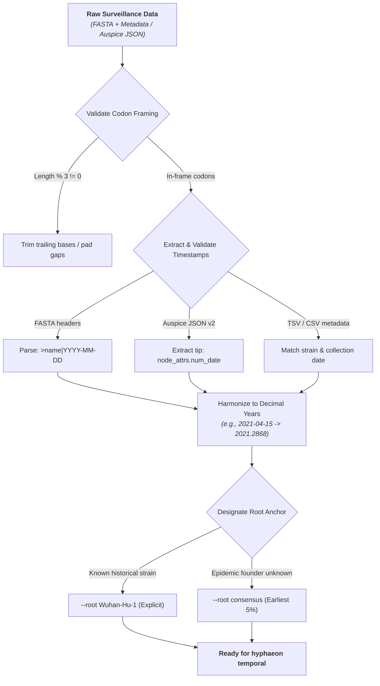
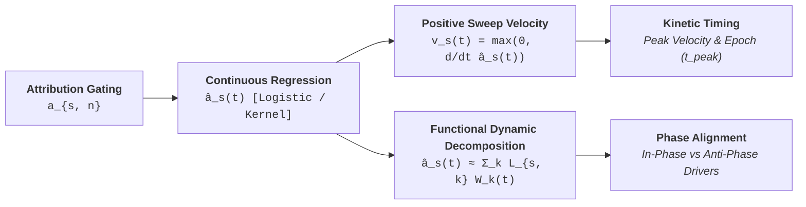
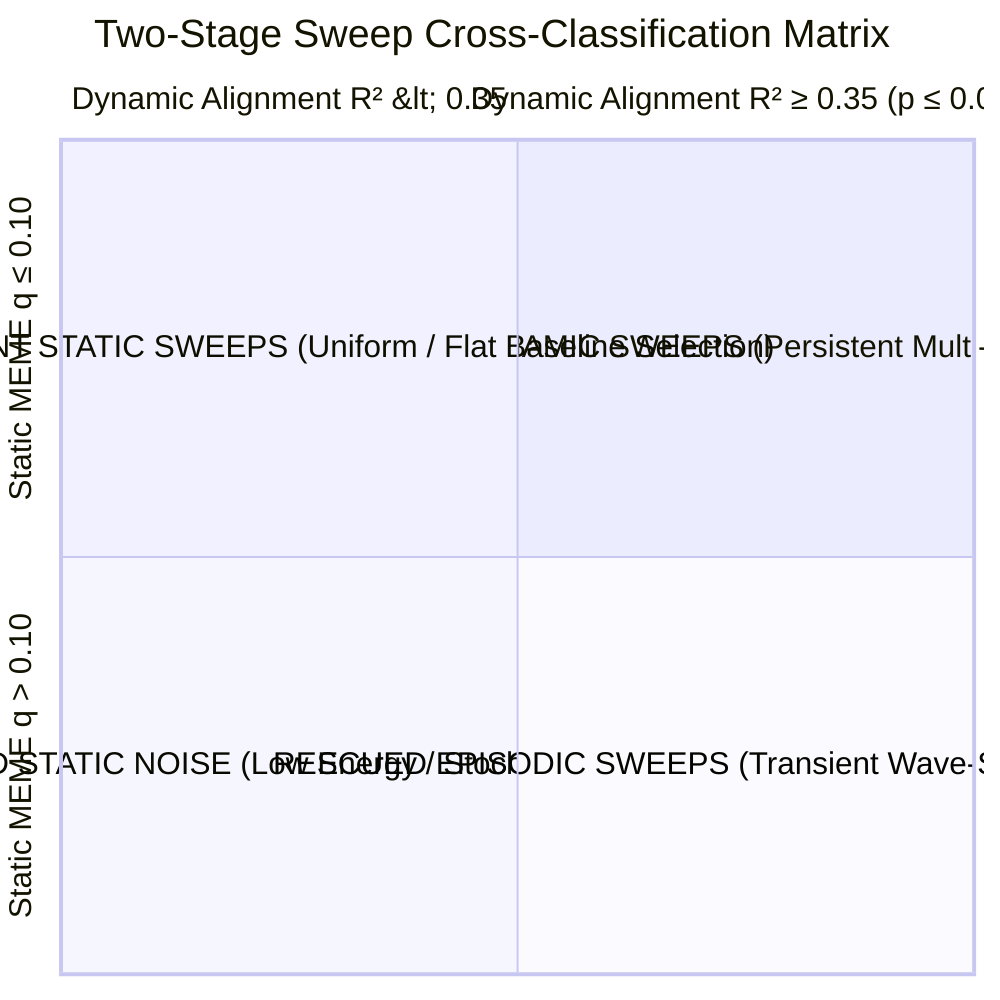

# Agent Operational Guide: Preparing, Running, and Interpreting Pathogen Temporal Selection Analyses

Modern pathogen surveillance generates massive, time-stamped genomic collections that chronicled the day-by-day evolutionary trajectory of viral and bacterial epidemics. Standard phylogenetic selection analyses (such as classical MEME, FEL, or BUSTED) treat these data statically, collapsing temporal depth into a single timeless tree topology. In doing so, static models miss transient selective bursts, conflate early variant replacements with late ancestral shifts, and remain blind to the continuous kinematics of selective sweeps.

The **HyphAeon Temporal Analysis Engine** (`hyphaeon temporal`) resolves this limitation. By coupling neural directional leaf attention gating with continuous logistic trajectory regression, two-stage permutation null filtering, and functional dynamic factor decomposition (fPCA), HyphAeon recovers the continuous kinematics of positive selection across epidemiological time.

This guide provides concrete, end-to-end instructions for autonomous agents and computational researchers to **prepare surveillance data**, **configure and execute temporal runs**, and **rigorously interpret outputs**.

---

## 1. Data Preparation Guidelines

Temporal selection inference requires three coordinated inputs: (1) a codon-aligned sequence collection, (2) explicit or extractable temporal timestamps, and (3) an anchored evolutionary root or reference founder. Failing to validate these inputs prior to execution will compromise downstream trajectory regression.



---

### 1.1 Alignment Formatting & Reading Frame Integrity

1. **In-Frame Codon Representation**:
   Alignments must represent in-frame coding sequences (nucleotide sequence length $L_{\text{nt}}$ divisible by 3). Stop codons should be stripped or masked with `---`. Shorter sequences should be padded with gaps (`-`) to preserve uniform alignment length.
2. **Ambiguity & Gap Handling**:
   Nucleotide ambiguities (`N`, `R`, `Y`) are automatically handled during tokenization. However, sequences with $>20\%$ missing data or excessive gap runs should be pruned upstream to prevent spurious jump discontinuities in attribution trajectories.
3. **Identifier Harmonization**:
   Sequence names must contain no unescaped whitespace, quotes, or trailing carriage returns. If metadata tables are used, taxon names in the FASTA file must match the metadata `strain` or `isolate` identifier column exactly.

---

### 1.2 Temporal Timestamp Ingestion Formats

HyphAeon supports three distinct mechanisms for ingesting sequence collection dates, automatically harmonizing all representations into decimal calendar years (e.g., `2021-04-15` $\rightarrow$ `2021.2868`).

#### Mechanism A: Embedded FASTA Headers (Preferred for Self-Contained Runs)
Append the collection date directly to the FASTA header using a pipe (`|`) or underscore (`_`) delimiter. Supported date formats include ISO-8601 (`YYYY-MM-DD`, `YYYY-MM`), decimal years (`YYYY.frac`), or slash formatting (`YYYY/MM/DD`):

```text
>USA/WA-CDC-UW210415/2021|2021-04-15
ATGTTTGTTTTTCTTGTTTTATTGCCACTAGTCTCTAGTCAG...
>hCoV-19/England/PHE-1234/2020|2020.9562
ATGTTTGTTTTTCTTGTTTTATTGCCACTAGTCTCTAGTCAG...
>B.1.1.7_Alpha_isolate_01|2021-01-XX
ATGTTTGTTTTTCTTGTTTTATTGCCACTAGTCTCTAGTCAG...
```
*Note*: Partial dates with unknown days (`2021-04-XX` or `2021-04`) are imputed to the 15th of the month. Years alone (`2021`) are imputed to mid-year (`2021.5`).

#### Mechanism B: Nextstrain Auspice JSON v2
If your dataset originates from a Nextstrain build, pass the Auspice JSON directly via `--dates`:

```bash
hyphaeon temporal -a alignment.fasta -t tree.nwk --dates auspice_v2.json [options]
```
The parser recursively walks the tree hierarchy, extracting tip dates from `node_attrs.num_date.value`, `node_attrs.date.value`, or `node_attrs.year.value`.

#### Mechanism C: Tabular Surveillance Metadata (TSV / CSV / Excel)
Provide an external tabular metadata file via `--dates`:

```text
strain	collection_date	lineage	country
USA/WA-CDC-01/2021	2021-03-12	B.1.1.7	USA
England/PHE-02/2020	2020-11-28	B.1.1.7	United Kingdom
ZAF/KRISP-K003/2020	2020-10-15	B.1.351	South Africa
```
The parser automatically scans for strain identifiers (`strain`, `name`, `isolate`, `accession`, `id`) and date columns (`date`, `collection_date`, `num_date`, `time`, `sample_date`). If non-standard column names are used, specify them explicitly:

```bash
hyphaeon temporal -a aln.fasta --dates metadata.tsv --date-col sample_date --id-col strain
```

---

### 1.3 Root Anchoring & Evolutionary Reference Selection

Attribution regression measures the accumulation of derived substitutions relative to an ancestral reference. Designating an inappropriate root will invert or distort selection trajectories.

1. **Explicit Historical Outgroup / Founder (Recommended)**:
   For epidemics with a well-characterized historical index case, pass the exact taxon name via `--root`:
   * SARS-CoV-2: `--root Wuhan-Hu-1` (or earliest ancestral lineage A isolate).
   * Influenza A/H3N2: `--root A/Darwin/6/2021` (or focal seasonal vaccine strain).
   * HIV-1: Outgroup subtype or earliest historical isolate (e.g., `HXB2`).
2. **Automated Ancestral Consensus (`--root consensus`, Default)**:
   When no individual sequence is designated as the historical founder, HyphAeon pools the earliest $5\%$ of sampled sequences (or all sequences if sample dates are closely clustered) and derives an in-frame ancestral majority consensus sequence.

---

### 1.4 Downsampling & Temporal Stratification

Sequencing intensity often fluctuates wildly across an epidemic—surveillance volume in late 2021 may exceed early 2020 by orders of magnitude. 

* **The Trap**: Naive random subsampling will drown out early epidemic waves (Alpha, Beta) while over-representing peak surveillance months (Omicron BA.1/BA.2).
* **The Remedy**: When dealing with megadatasets ($N > 20{,}000$ genomes), perform **uniform temporal downsampling** prior to HyphAeon execution: bin sequences into bi-weekly or monthly windows, sample at most $K$ genomes per window (e.g., $K = 50\text{--}100$), and preserve all early ancestral samples.

---

## 2. Running Temporal Analyses

The temporal module is executed via the `hyphaeon temporal` command-line interface or imported directly into Python analysis workflows.

```bash
# Production Surveillance Run: Continuous Selection Dynamics & Figure Generation
hyphaeon temporal \
  -a surveillance_spike.fasta \
  -t surveillance_spike.nwk \
  --dates surveillance_metadata.tsv \
  --root Wuhan-Hu-1 \
  --time-bins 40 \
  --min-r2 0.35 \
  --min-peak-intensity 0.15 \
  --min-cumulative-auc 0.50 \
  --n-permutations 1000 \
  --max-perm-p 0.05 \
  --out-dir results_temporal/ \
  --pdf-out results_temporal/temporal_dynamics.pdf \
  --png-out results_temporal/temporal_dynamics.png
```

---

### 2.1 Critical Command-Line Flags & Parameter Calibration

| Flag | Type | Default | Operational Role & Tuning Guidelines |
| :--- | :--- | :--- | :--- |
| **`-a, --alignment`** | `str` | *Required* | Path to codon-aligned multi-sequence FASTA file. |
| **`-t, --tree`** | `str` | `None` | Path to Newick/NEXUS tree. If omitted, pass `--no-tree` / `--use-tn93`. |
| **`--no-tree` / `--use-tn93`** | `flag` | `False` | Computes pairwise TN93 distance matrix directly, bypassing tree building. |
| **`--dates`** | `str` | `None` | Path to Auspice JSON, TSV, CSV, or Excel metadata. Optional if headers have dates. |
| **`--root`** | `str` | `"consensus"`| Ancestral reference taxon name or `"consensus"`. |
| **`--time-bins`** | `int` | `40` | Grid resolution for trajectory regression. Use 30–50 for multi-year epidemics (~1 bin/month). |
| **`--min-r2`** | `float` | `0.35` | Minimum dynamic wave alignment $R^2$. Filters out static and uncoordinated noise. |
| **`--min-peak-intensity`**| `float` | `0.15` | Minimum peak attribution height $\max_t \hat{a}_s(t)$. Eliminates negligible fluctuations. |
| **`--min-cumulative-auc`**| `float` | `0.50` | Minimum cumulative trajectory area. Filters out transient singleton errors. |
| **`--n-permutations`** | `int` | `1000` | Date-shuffling permutation null count. Evaluates trajectory dynamic significance. |
| **`--max-perm-p`** | `float` | `0.05` | Permutation significance threshold ($p_{\text{perm}} \le 0.05$). |
| **`--batch-size`** | `int` | `Auto` | Codon site batch size (automatically capped to prevent GPU out-of-memory). |
| **`--cpu`** | `flag` | `False` | Forces CPU execution; omit to auto-detect Apple Silicon MPS or NVIDIA CUDA. |
| **`--out-dir`** | `str` | `"./"` | Target directory for all output tables and summary JSON artifacts. |

---

### 2.2 Scriptable Python API Invocation

For programmatic pipelines, automated validation loops, or Jupyter notebook workflows:

```python
from hyphaeon.temporal import run_temporal_analysis

results = run_temporal_analysis(
    alignment_path="surveillance_spike.fasta",
    tree_path="surveillance_spike.nwk",
    dates_path="surveillance_metadata.tsv",
    root_spec="Wuhan-Hu-1",
    time_bins=40,
    min_r2=0.35,
    min_peak_intensity=0.15,
    min_cumulative_auc=0.50,
    n_permutations=1000,
    max_perm_p=0.05,
    out_dir="results_temporal",
    pdf_out="results_temporal/temporal_dynamics.pdf",
    png_out="results_temporal/temporal_dynamics.png",
    device="cuda:0"  # or "mps", "cpu"
)

print(f"Confirmed Dynamic Sweeps: {results['summary']['counts']['confirmed_sweeps']}")
print(f"Rescued Episodic Sweeps: {results['summary']['counts']['rescued_sweeps']}")
```

---

## 3. Comprehensive Output Interpretation

The temporal engine generates five structured output artifacts in `--out-dir`. Each artifact addresses a distinct statistical or dynamic question.

```text
results_temporal/
├── temporal_summary.json       <- Global run parameters, wave variance, category counts
├── temporal_sites.csv          <- Per-site metrics, sweep classifications, factor loadings
├── temporal_trajectories.csv   <- Site-by-time selection trajectories: a_s(t)
├── sweep_velocities.csv        <- Positive sweep velocities: v_s(t) = max(0, d/dt a_s(t))
├── dynamic_waves.csv           <- Collective wave trajectories: W_1(t) .. W_4(t)
└── temporal_dynamics.pdf       <- 4-panel publication-grade summary figure
```

---

### 3.1 The Mathematical Engine: Trajectories, Velocities, and Factor Loadings

To interpret the outputs, agents must understand the four primary mathematical metrics computed for each codon position $s$:



1. **Continuous Selection Trajectory ($\hat{a}_s(t)$)**:
   Measures the cumulative evolutionary selection intensity at site $s$ at time $t$. Modeled via continuous logistic trajectory regression or Gaussian kernel smoothing over derived substitution states:
   $$\hat{a}_s(t) = \frac{K_s}{1 + \exp(-r_s (t - t_{0, s}))}$$
   where $K_s$ is the asymptotic carrying capacity, $r_s$ is the logistic growth rate, and $t_{0, s}$ is the inflection midpoint.
2. **Positive Sweep Velocity ($v_s(t)$)**:
   Measures the instantaneous rate of selective sweep acceleration. Defined as the non-negative time derivative of the continuous trajectory:
   $$v_s(t) = \max\left(0, \frac{d}{dt} \hat{a}_s(t)\right)$$
   *Biological Meaning*: Velocity peaks during the active replacement epoch when an adaptive variant rapidly sweeps through the host population, dropping to zero once fixation or stationary prevalence is reached.
3. **Dynamic Wave Modes ($W_k(t)$)**:
   Singular value decomposition (SVD) across all standardized trajectories extracts the four leading collective orthogonal wave modes ($W_1(t), W_2(t), W_3(t), W_4(t)$). These modes correspond to major epidemic replacement waves (e.g., in SARS-CoV-2: $W_1$ = Pre-Omicron/Delta transition, $W_2$ = Omicron BA.1 displacement, $W_3$ = BA.5/BQ.1 takeover, $W_4$ = XBB/JN.1 diversification).
4. **Site Factor Loadings ($L_{s, k}$)**:
   Represent the projection of site $s$ onto dynamic wave $k$:
   $$\hat{a}_s(t) \approx \sum_{k=1}^4 L_{s, k} W_k(t)$$
   * **$L_{s, k} \gg 0$ (In-Phase Driver)**: The substitution expands synchronously with Wave $k$.
   * **$L_{s, k} \ll 0$ (Anti-Phase Displaced State)**: The residue reflects an ancestral state that is actively purged or replaced during Wave $k$.
   * **$L_{s, k} \approx 0$ (Orthogonal / Passenger)**: The mutation is uncoupled from Wave $k$ dynamics.

---

### 3.2 Two-Stage Cross-Classification Schema

Every codon site is classified into one of four mutually exclusive statistical categories in `temporal_sites.csv` (`classification` column):



1. **`Confirmed Sweep` (High Confidence Persistent Adaptation)**:
   * *Conditions*: Passes static selection ($\text{FDR } q \le 0.10$) **AND** demonstrates rigorous temporal dynamic alignment ($R^2 \ge 0.35, p_{\text{perm}} \le 0.05$).
   * *Biological Meaning*: Iconic adaptive drivers that recurrently diversified across multiple waves (e.g., SARS-CoV-2 Spike 484, 501, 614, 681).
2. **`Rescued Sweep` (Transient Wave-Specific Innovation)**:
   * *Conditions*: Missed by static MEME ($\text{FDR } q > 0.10$), but exhibits strong, coordinated temporal sweep dynamics ($R^2 \ge 0.35, p_{\text{perm}} \le 0.05$).
   * *Biological Meaning*: A critical adaptive mutation that swept rapidly within a single isolated clade or variant wave, but whose signal was diluted or penalized across the whole-tree topology in static models.
3. **`Concordant Static Sweep` (Pervasive Uniform Diversification)**:
   * *Conditions*: Significant in static MEME ($\text{FDR } q \le 0.10$), but exhibits flat or uncoordinated temporal dynamics ($R^2 < 0.35$).
   * *Biological Meaning*: Baseline pervasive positive selection acting consistently across the tree without episodic variant bursts.
4. **`Filtered Noise` (Stochastic / Neutral Artifacts)**:
   * *Conditions*: Fails the energy floor ($\text{Peak} < 0.15$ or $\text{AUC} < 0.50$) or fails permutation testing ($p_{\text{perm}} > 0.05$).
   * *Biological Meaning*: Transient sequencing errors or neutral hitchhiking mutations lacking collective selective drive.

---

### 3.3 Deconstructing the 4-Panel Publication Figure

When `--pdf-out` or `--png-out` is supplied, HyphAeon renders a standardized 4-panel publication visualization (`temporal_dynamics.pdf`):

```text
+-------------------------------------------------------------------------------+
|  PANEL A: Collective Dynamic Wave Modes (fPCA Eigen-Trajectories W_1 .. W_4)   |
|  [Four colored curves tracking the rise, peak, and collapse of variant waves] |
+-------------------------------------------------------------------------------+
|  PANEL B: Positive Sweep Velocity Waterfall Matrix                            |
|  [Heatmap of v_s(t) across all sites, sorted chronologically by peak epoch]   |
+-------------------------------------------------------------------------------+
|  PANEL C: Trajectory Map of Iconic / Top Confirmed Adaptive Codons            |
|  [Multi-line tracking of a_s(t) for top sites, highlighting sweep timing]     |
+-------------------------------------------------------------------------------+
|  PANEL D: Factor Loading Phase Space (L_{s, 1} vs. L_{s, 2})                  |
|  [Bivariate scatter separating distinct evolutionary trajectories & clusters] |
+-------------------------------------------------------------------------------+
```

* **Reading Panel A (Dynamic Waves)**:
  Examine peak dates. Each curve peaks during the historical window of maximal lineage turnover. Look for successive waves where the decline of $W_1$ coincides precisely with the ascent of $W_2$.
* **Reading Panel B (Waterfall Matrix)**:
  Codons are sorted along the vertical axis by their peak velocity date ($t_{\text{peak}}$). Coordinated horizontal bands indicate epistatically linked substitutions that swept simultaneously within the same viral background.
* **Reading Panel C (Trajectory Map)**:
  Tracks individual trajectories $\hat{a}_s(t)$. Steep sigmoidal ascents denote rapid positive selection; plateauing curves indicate fixed substitutions whose selective pressure has saturated.
* **Reading Panel D (Phase Space)**:
  Sites in the upper-right quadrant ($L_1 > 0, L_2 > 0$) cooperate in the primary wave transition; sites in opposing quadrants represent mutually exclusive or competing evolutionary adaptations.

---

## 4. Agent Operational Checklist: Step-by-Step Execution Recipe

When an agent is tasked with running temporal analysis on a novel pathogen dataset, it must follow this exact execution protocol:

```text
[ ] STEP 1: Inspect FASTA header format using 'head -n 10 <alignment.fasta>'.
    - If headers contain ISO dates (e.g., '|2021-04-15'), proceed directly.
    - If headers lack dates, verify that a metadata table (TSV/CSV) or Auspice JSON exists.

[ ] STEP 2: Validate coding frame length.
    - Confirm length is divisible by 3 and check for internal stop codons.

[ ] STEP 3: Identify the historical founder or ancestral outgroup.
    - Designate '--root <founder_taxon>' or set '--root consensus'.

[ ] STEP 4: Choose tree execution mode.
    - If a validated phylogenetic tree is available: pass '-t <tree.nwk>'.
    - If tree is missing or alignment exceeds 10,000 sequences: pass '--no-tree' / '--use-tn93'.

[ ] STEP 5: Launch 'hyphaeon temporal' with standardized thresholds.
    - Always set: '--min-r2 0.35 --min-peak-intensity 0.15 --min-cumulative-auc 0.50 --n-permutations 1000'.
    - Specify: '--out-dir <output_dir> --pdf-out <output_dir>/temporal_dynamics.pdf'.

[ ] STEP 6: Parse 'temporal_sites.csv' and 'temporal_summary.json' upon completion.
    - Extract counts of Confirmed Sweeps and Rescued Sweeps.
    - Identify the top 5 highest velocity sites and their peak epochs (t_peak).

[ ] STEP 7: Synthesize findings in report.
    - Summarize major wave turnover epochs from 'dynamic_waves.csv'.
    - Corroborate whether iconic literature sites were Confirmed or Rescued.
    - Present the generated 4-panel figure to the user.
```
