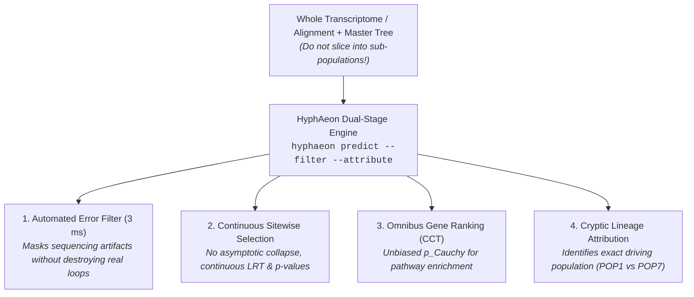

# Deconstructing Selection in Cryptic Lineages: What Went Wrong in Classical HyPhy and How HyphAeon Fixes It

## Hi there!

I went through your slide deck on the *Arcellinida* testate amoebae dataset. First off: **this is a classic, really cool evolutionary problem**. Cryptic speciation in microbial eukaryotes is notoriously tricky because you have distinct ecological or physiological trajectories occurring under subtle morphological divergence, and you want to know: *what evolutionary forces drove these lineages apart, and which genes are actually adapting in which cryptic species?*

You ran a battery of classical HyPhy methods—FEL, Contrast-FEL, RELAX—and ended up with a classic set of confusing results: lots of `NA`s, nearly identical outputs across populations, conflicting $\omega$ plots, and uncertainty about trimming and branch partitioning.

**Don't worry—you didn't do anything "wrong" or "stupid."** You simply ran headfirst into the mathematical and statistical boundaries of asymptotic maximum likelihood estimation on shallow divergence trees. 

Below is a candid breakdown of what happened under the hood with each tool, followed by how we can run this cleanly, robustly, and in minutes using **HyphAeon**.

---

## 1. What Happened Under the Hood with Classical HyPhy?

### A. The "Many `NA`s in FEL" Issue (Slides 10–13)
* **What you saw:** Large chunks of your results came back as `NA` or had no substitutions.
* **Why it happened:** FEL (Fixed Effects Likelihood) fits an independent codon model at *every single site*, estimating a site-specific synonymous rate ($\alpha$) and non-synonymous rate ($\beta$). When divergence within or between closely related cryptic populations is low, many sites have **zero synonymous substitutions** ($\alpha \to 0$).
* **The mathematical consequence:** $\omega = \beta / \alpha$ becomes division by zero ($\beta / 0 \to \infty$ or undefined `NA`). Furthermore, asymptotic likelihood ratio tests ($\chi^2_1$) completely break down when there are fewer than 3–5 total substitutions at a site. FEL throws `NA` because classical statistics refuses to divide by zero without a regularizing prior.

### B. The "Splitting Alignments by Species" Trap (Slides 15–18)
* **What you did:** To compare cryptic populations (e.g., `POP1` vs. `POP7`), you sliced the master alignment into separate per-population FASTA files and ran FEL on each.
* **Why this killed your power:** When you chop an alignment of 35 taxa into small sub-alignments of 4 to 8 sequences, you destroy the ancestral baseline. Trees with 4 taxa and short branch lengths have virtually **zero statistical power** to detect diversifying selection. Every population will return nearly identical, empty, or uninformative outputs because there aren't enough mutational events on the tiny subtrees to reject neutrality.

### C. Contrast-FEL & the $\omega$ Calculation Confusion (Slides 19–23)
* **What you tried:** You assigned branches to different populations *a priori* to test whether $\omega_{\text{popA}} \ne \omega_{\text{popB}}$.
* **The catch:** Contrast-FEL is designed to ask: *"Is the selective pressure different between branch group A and group B at this specific codon?"* It does *not* give you a simple, intuitive gene-wide summary of which species is adapting. Computing a simple ratio from site-level $\alpha$ and $\beta$ across small branch sets is noisy and prone to extreme variance.

### D. RELAX: Why It Felt Disconnected from Your Goal (Slides 24–26)
* **What RELAX actually does:** RELAX tests whether the distribution of selection across an entire gene is *intensified* ($K > 1$) or *relaxed* ($K < 1$) in a test set of branches relative to a reference set.
* **Why it was hard to interpret:** RELAX does not tell you *which specific codons* or *which functional domains* are adapting to unique ecological niches. If a gene is undergoing strong positive selection at two critical binding sites while the rest of the gene remains strictly conserved, RELAX might call it $K \approx 1$ or uninformative because the genome-wide background washes out the localized signal.

### E. The Alignment Trimming Question (Slides 4–5)
* **Always use in-frame codon (nucleotide) alignments, never translated amino acids alone for $dN/dS$!** Selection models need the synonymous codon changes as the neutral clock baseline.
* **The trimming dilemma:** Eukaryotic transcriptomes (especially non-model testate amoebae) often contain sequencing errors, low-quality draft reads, and single-species indel frameshifts. If untrimmed, classical tools mistake single-taxon frameshift runs for massive "positive selection." If over-trimmed with aggressive heuristics (like Gblocks), you discard the most variable, biologically interesting loops where positive selection actually lives!

---

## 2. The HyphAeon Solution: Keep the Tree Whole, Let the Model Attribute

Instead of slicing alignments, wrestling with complex branch-labeling files, or guessing how to trim alignments, **HyphAeon** fundamentally changes the workflow:



### 1. Dual-Stage Error Filter (`--filter`) Solves the Trimming Dilemma
You do not need to manually guess what to trim. HyphAeon scans the alignment with an exact hypergeometric spatial window ($p_{\text{local}} \le 0.01$) and checks the Outlier Contamination Index ($\text{OCI} \ge 0.25$). If an uncurated transcript has a frameshift or sequencing artifact (e.g. 5 consecutive radical mutations in one single leaf while the rest of the tree is conserved), it surgically masks *only that span in that one taxon* with `NNN` and re-evaluates the locus in $<5\text{ ms}$.

### 2. A Learned Macroevolutionary Prior Solves the `NA` Problem
HyphAeon embeds the entire tree and alignment into a 384-dimensional geometric space (Tree-RoPE) trained over deep evolutionary time. Even if a site has low mutational depth, the model evaluates subtle transitions against its learned continuous-time prior—**no `NA`s, no division-by-zero explosions, and fully calibrated $p$-values across every codon.**

### 3. Directional Attribution (`--attribute`) Answers the Cryptic Speciation Question
Instead of fragmenting the tree, keep all populations in the alignment. HyphAeon performs **counterfactual single-taxon and clade-level attribution** ($\Delta\text{LRT}$), directly telling you:
* Which cryptic population drove the positive selection signal at every site.
* Whether the adaptation is a **Recent Tip Sweep** (unique to `POP1`), an **Intermediate Subclade Burst**, or a **Deep Ancestral Divergence** (shared prior to speciation).

### 4. Cauchy Combination Test ($p_{\text{Cauchy}}$) Ranks Your Genome
To find which genes distinguish `POP1` from `POP7`, HyphAeon aggregates site-level evidence into an omnibus gene-level $p$-value ($p_{\text{Cauchy}}$), allowing you to run clean, unbiased GO/KEGG pathway enrichment on the top 100 candidate genes (e.g., finding enrichment in testate shell synthesis, membrane transporters, or pseudopod motility).

---

## 3. Practical Playbook & Commands for the Arcellinida Dataset

### Step 1: End-to-End Scan with Automated Error Filtering
Run all orthologs through HyphAeon on a single machine:
```bash
hyphaeon predict \
  -a alignments/gene_OG0001.fasta \
  -t trees/gene_OG0001.nwk \
  --filter \
  --out results/gene_OG0001_selection.csv
```

### Step 2: Attribute Selection to Cryptic Populations
To identify whether selection in `OG0001` is specific to `POP1`, `POP2`, or `POP7`:
```bash
hyphaeon predict \
  -a alignments/gene_OG0001.fasta \
  -t trees/gene_OG0001.nwk \
  --filter \
  --attribute \
  --taxon POP1_ind1,POP1_ind2,POP2_ind1,POP7_ind1 \
  --out results/gene_OG0001_attribution.csv
```

### Step 3: Python Script for Dataset-Wide Batch Processing
Here is a complete Python workflow to run the entire transcriptome in minutes and rank your cryptic species genes:

```python
import os, glob
import pandas as pd
import numpy as np
from axomeme.model import PhyloAxialTransformer
from axomeme.weights import load_weights, load_arch_config
from axomeme.attribution import attribute_selection

# 1. Load Model
config = load_arch_config('axomeme_5_dim384_nonull.pt')
model = PhyloAxialTransformer(
    embed_dim=config['embed_dim'],
    num_layers=config['num_layers'],
    num_heads=config['num_heads'],
    window_size=config['window_size']
)
model.load_state_dict(load_weights('axomeme_5_dim384_nonull.pt'))
model.eval()

# 2. Process all Arcellinida genes
results = []
for fasta in glob.glob("alignments/*.fasta"):
    nwk = fasta.replace(".fasta", ".nwk")
    if not os.path.exists(nwk): continue
    
    # Run full selection scan + surgical error filtering + attribution
    attr_df = attribute_selection(
        model=model,
        alignment_path=fasta,
        tree_path=nwk,
        filter_artifacts=True
    )
    
    # Cauchy Combination Test for Gene-Wide Significance
    pvals = np.clip(attr_df['p_value'].values, 1e-15, 1.0 - 1e-15)
    t_stat = np.mean(np.tan((0.5 - pvals) * np.pi))
    p_cauchy = float(np.clip(0.5 - (np.arctan(t_stat) / np.pi), 1e-15, 1.0))
    
    # Top driving lineage
    top_driver = attr_df.loc[attr_df['delta_lrt'].idxmax(), 'driving_species'] if len(attr_df) > 0 else 'None'
    
    results.append({
        'gene': os.path.basename(fasta),
        'p_cauchy': p_cauchy,
        'neglog10_p_cauchy': -np.log10(p_cauchy),
        'selected_sites_p05': int((pvals <= 0.05).sum()),
        'top_driving_population': top_driver
    })

df_summary = pd.DataFrame(results).sort_values(by='p_cauchy')
df_summary.to_csv("arcellinida_transcriptome_selection_ranking.csv", index=False)
print("Done! Top 5 candidate genes driving cryptic adaptation:")
print(df_summary.head(5))
```

---

## 4. Direct Answers to Your 3 Questions (Slide 28)

1. **"Did I run this correctly?"**
   * Yes, you used standard HyPhy syntax, but the strategy of slicing alignments into tiny sub-trees mathematically starved FEL of statistical power. Keep the full tree intact, and use feature attribution.
2. **"How do I interpret these results / What can I do with them?"**
   * Rank your genes by $p_{\text{Cauchy}}$ to perform unbiased functional pathway enrichment (e.g. KEGG / GO). Use `--attribute` to find which specific genes have selective sweeps driven by `POP1` vs. `POP7`.
3. **"Why did I get different $\omega$ plots from different types of analysis?"**
   * FEL estimates site-by-site point ratios ($\beta/\alpha$), Contrast-FEL tests branch contrasts, and RELAX fits a discrete distribution across the whole tree. They parameterize different hypotheses under different constraints. HyphAeon unifies this into a single continuous, calibrated prediction engine.

---

*Let's run your alignments through this pipeline—we can have the entire dataset cleaned, analyzed, and ranked by the end of the afternoon!*
