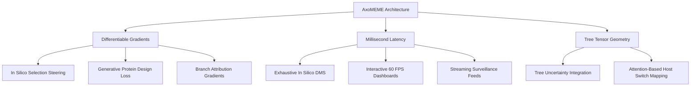

# Novel Applications and Research Frontiers Enabled by AxoMEME

AxoMEME transforms episodic diversifying selection analysis from a slow numerical optimization bottleneck into an **end-to-end differentiable, millisecond-scale geometric deep learning pipeline**. This document catalogs paradigm-shifting applications that are computationally or mathematically impossible under classical Maximum-Likelihood (ML) frameworks like HyPhy MEME.

---

## Core Paradigm Shifts: AxoMEME vs. Classical ML (MEME)

| Dimension | Classical ML (HyPhy MEME) | Neural Surrogate (AxoMEME) |
| :--- | :--- | :--- |
| **Mathematical Nature** | Opaque numerical optimization loop (Felsenstein's pruning + BFGS) | **Fully Differentiable PyTorch Computation Graph** ($\nabla_{\text{Input}} \text{LRT}$) |
| **Site Inference Latency** | Minutes to hours per gene ($O(L \cdot N^2)$ numerical fits) | **1 to 25 milliseconds per site** ($>10,000\times$ acceleration) |
| **Tree Space Evaluation** | Single fixed tree per run (re-running takes hours) | **Batched Posterior Integration** ($10^3\text{--}10^4$ trees in seconds) |
| **Perturbation In Silico** | $25,000$ mutant scans $\approx 3\text{--}7\text{ years}$ CPU compute | **$25,000$ mutant scans $\approx 5\text{--}10\text{ minutes}$ GPU compute** |
| **Model Coupling** | Cannot couple to generative loss functions | **Directly differentiable reward/fitness prior** for ESM/AlphaFold |

---

---

## 1. Differentiable Molecular Evolution & Inverse Selection Design

### The Concept
Because AxoMEME is an analytical PyTorch computation graph, one can compute exact gradients of the predicted selection test statistic with respect to input codon embeddings and continuous phylogenetic coordinates:
$$\nabla_{X} \widehat{\text{LRT}} = \frac{\partial \widehat{\text{LRT}}}{\partial X_{\text{codon}}}, \quad \nabla_{Z} \widehat{\text{LRT}} = \frac{\partial \widehat{\text{LRT}}}{\partial Z_{\text{MDS}}}$$

### Novel Use Cases
1. **Targeted Selection Relieving / Steering**:
   - In viral vaccine antigen design, identify which minimal combinatorial mutations in a candidate immunogen will maximally *suppress* evolutionary escape potential at a critical epitope cleft while preserving overall structural integrity.
2. **Differentiable Branch Attribution**:
   - Compute $\partial \widehat{\text{LRT}} / \partial d_{ij}$ with respect to tree branch lengths. This directly isolates which specific zoonotic jump, speciation event, or epidemic wave contributed the largest share of episodic diversifying selection signal without requiring combinatorial clade testing.

---

## 2. Exhaustive In Silico Deep Mutational Scanning (DMS) & Epistatic Selection Landscapes

### The Concept
In classical phylogenetics, evaluating how all possible single-point mutations in an alignment alter the selection profile requires $61 \times L$ full maximum-likelihood fits (e.g., $61,000$ fits for a 1,000-codon gene $\approx 7\text{ years}$ of CPU compute). AxoMEME evaluates all 61,000 variants in **under 10 minutes** on a single modern GPU.

### Novel Use Cases
1. **Epistatic Selection Sensitivity Matrix (ESSM)**:
   - Introduce an in silico mutation $m$ at site $i$ and measure the directional change in predicted episodic selection at distant site $j$:
     $$\Delta \text{LRT}_{j}^{(i, m)} = \text{AxoMEME}(X^{(i \to m)})_j - \text{AxoMEME}(X)_j$$
   - This builds an all-to-all $(L \times L)$ epistatic coupling map, discovering allosteric networks where a mutation in a core structural domain unlocks or restricts evolutionary plasticity at the receptor-binding surface.
2. **Pre-Emptive Pathogen Variant Forecasting**:
   - Systematically scan all single- and double-mutants of circulating epidemic variants (e.g., emerging SARS-CoV-2 or Avian Influenza H5N1 clades) to forecast which unobserved lineages will experience accelerated episodic diversification.

---

## 3. Instantaneous Integration Over Phylogenetic Tree Uncertainty

### The Concept
Bayesian phylogenetic software (MrBayes, BEAST, RevBayes) produces posterior distributions containing thousands of candidate trees ($\mathcal{T} = \{T_1, T_2, \dots, T_K\}$). Classical codon models run on only one consensus or maximum-clade-credibility tree because evaluating $1,000$ trees is computationally prohibitive.

### Novel Use Cases
1. **True Tree-Marginalized Selection Probabilities**:
   - Pass an entire MCMC ensemble of $1,000\text{--}5,000$ candidate trees through AxoMEME via batched inference:
     $$P(\text{Positive Selection} \mid \text{Alignment}) = \frac{1}{K} \sum_{k=1}^K \text{AxoMEME}(\text{Alignment}, T_k)$$
   - This provides genuine Bayesian posterior uncertainty intervals for every codon site and completely eliminates false positive selection calls driven by local tree topology reconstruction errors.

---

## 4. Selection as a Differentiable Loss Function for Generative Protein Design

### The Concept
State-of-the-art protein design models (ESM-3, ProteinMPNN, RFdiffusion, AlphaFold) optimize sequences for structural thermodynamic stability ($\Delta \Delta G$) or sequence likelihood, but are **evolutionarily blind**—they have no concept of long-term selective constraint or mutational escape resistance.

### Novel Use Cases
1. **Evolutionary Plasticity Steering in Generative Diffusion**:
   - Use AxoMEME's continuous ordinal logit output as an auxiliary reward / penalty term during generative design sampling:
     $$\mathcal{L}_{\text{total}} = \mathcal{L}_{\text{structure}} + \lambda_{\text{stab}} \mathcal{L}_{\text{MPNN}} + \lambda_{\text{evol}} \mathcal{L}_{\text{AxoMEME}}(\widehat{\text{LRT}} \le \tau)$$
2. **Escape-Proof Universal Vaccines**:
   - Design viral immunogens engineered specifically so that their neutralizing epitopes are embedded in regions predicted to have near-zero evolutionary tolerance ($\text{LRT} \to 0$), forcing viral variants into structural dead-ends upon escape mutation.

---

## 5. Active Phylogenetic Surveillance & Optimal Sensor Placement

### The Concept
During active epidemic outbreaks where hundreds of thousands of raw genomes are sequenced (e.g., GISAID, NCBI Virus), laboratories have limited bandwidth for wet-lab neutralization testing or full-phylogeny modeling.

### Novel Use Cases
1. **Submodular Selection Power Maximization**:
   - Because AxoMEME evaluates downsampled alignments in seconds via Faith's Phylogenetic Diversity (PD), an active learning agent can dynamically select the exact $N = 500$ representative isolates that maximize statistical power to resolve emerging antigenic hotspots.
2. **Streaming Genomic Surveillance**:
   - When new viral sequences arrive daily via live laboratory feeds, AxoMEME can evaluate incremental phylogenetic updates in near-real-time without restarting multi-hour likelihood fits from scratch.

---

## 6. Real-Time Interactive "Phylo-What-If" Exploration (Web / Notebooks)

### The Concept
Classical selection tools are batch-oriented command-line jobs. AxoMEME's sub-second latency enables interactive GUI and browser-based exploration (e.g., via Observable Framework, WebAssembly/ONNX, or Jupyter widgets).

### Novel Use Cases
1. **Interactive In Silico Mutagenesis**:
   - Users can click on any residue in a 3D protein viewer (Mol* / NGL), mutate the residue or edit an ancestral node, and see the selection landscape and $p$-value profiles update across the protein at 60 FPS.
2. **Dynamic Clade Pruning / Host-Switch Simulation**:
   - Drag, drop, or prune entire host clades (e.g., remove all avian sequences from a zoonotic alignment) to instantly observe which human-adaptation signals disappear or intensify.

---

## 7. Attention-Based Lineage & Host-Switch Attribution

### The Concept
Standard MEME determines whether episodic diversifying selection has occurred at a site, but determining *which* branches experienced the selective burst requires secondary heuristics or fitting separate branch-site models across all candidate clades.

### Novel Use Cases
1. **Direct Attention Weight Decomposition**:
   - AxoMEME's row-attention matrices ($A_{\text{phylo}} \in \mathbb{R}^{N \times N}$) compute pairwise taxonomic importance weights. 
   - By performing attention rollout across the 6 transformer layers, one can directly trace the specific host-switching branches (e.g., bat $\to$ intermediate host $\to$ human) that drove the episodic selection spike at that residue.

---

## Next Steps & Implementation Roadmap

1. **Phase 1: In Silico DMS Proof-of-Concept**:
   - Build a Python utility `axomeme-dms` that computes the all-to-all single-mutant selection landscape on SARS-CoV-2 Spike (25,000 variants in $<10\text{ min}$).
2. **Phase 2: Differentiable Gradient Inversion**:
   - Implement `torch.autograd.grad` routines to map input token saliency maps ($\nabla_{\text{Input}} \text{LRT}$) for structural visualization in PyMOL / ChimeraX.
3. **Phase 3: Bayesian Tree Ensemble Evaluator**:
   - Add native BEAST/MrBayes nexus tree-set ingestion to output tree-marginalized selection credibility intervals.
